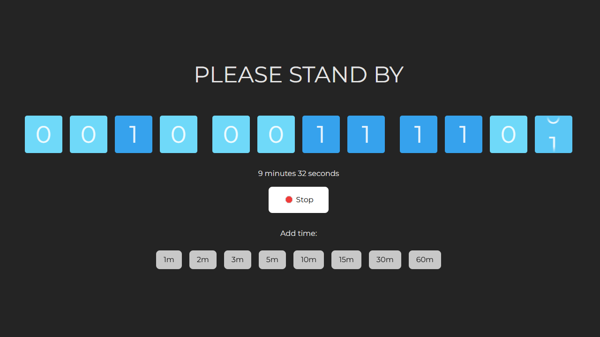

# Binary Timer

Binary Timer is a simple countdown timer that counts down in binary.

Available online at [https://binarytimer.surge.sh](https://binarytimer.surge.sh)

## Features

- 12-bit binary countdown timer
- Maximum time is 4095 seconds (68 minutes 15 seconds)
- Presets for 1, 2, 3, 5, 10, 15, 30, 60 minutes
- Controls to prolong countdown time
- Sound alarm when countdown is finished
- Dark/light themes

## Available parameters

- `time=10` - countdown from time in seconds
- `mode=minimalist` - hide all controls showing countdown timer only
